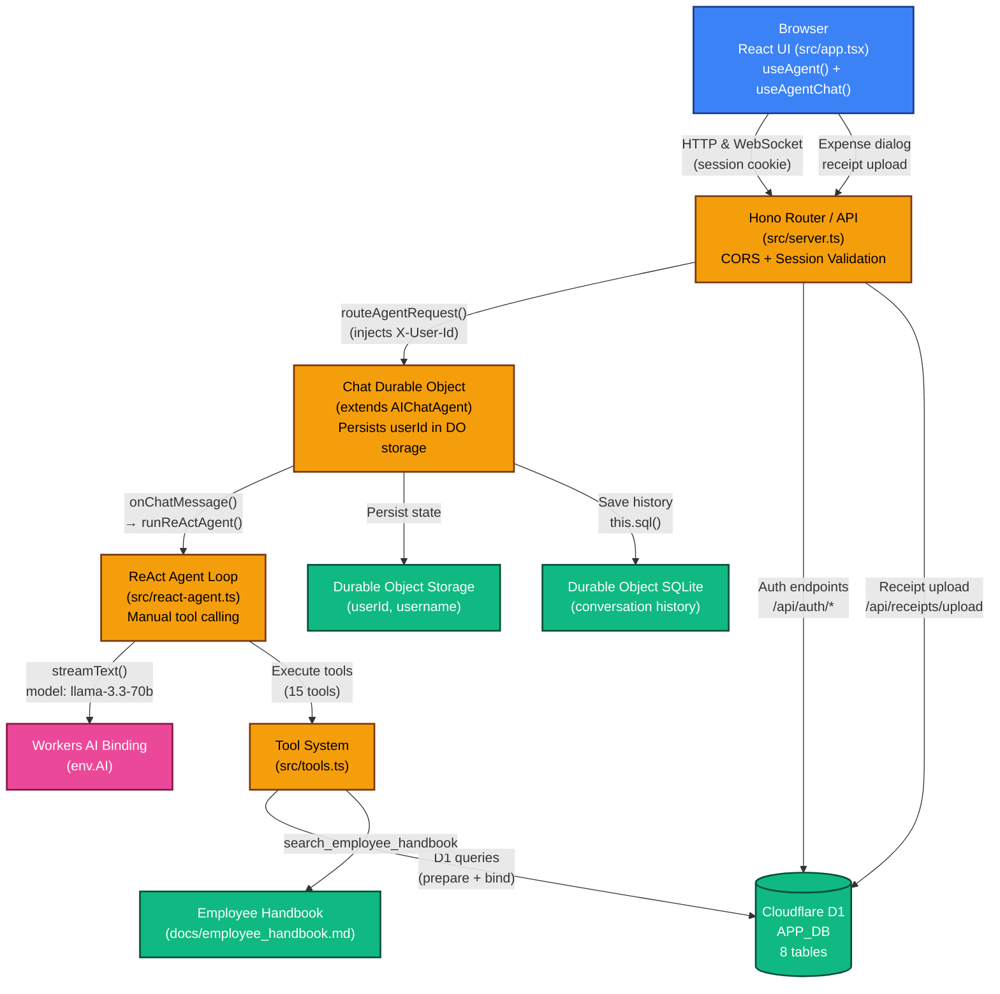
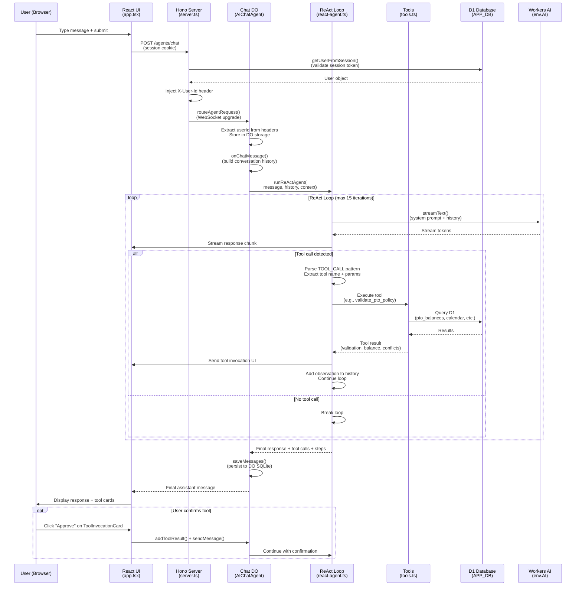
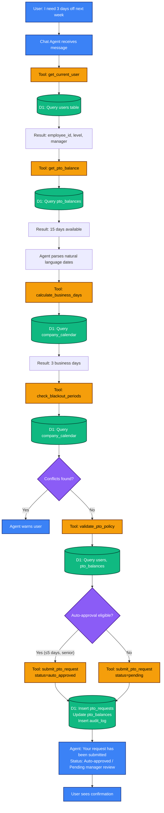
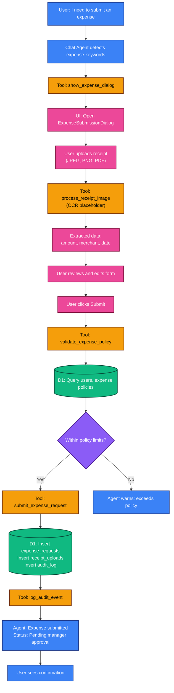

# ApprovalFlow AI — Architecture & Implementation

This document provides a comprehensive overview of the ApprovalFlow AI system architecture, runtime flows, and key implementation details. The application is an AI-powered approval workflow system built on Cloudflare Workers that handles employee PTO (Paid Time Off) requests and expense reimbursements through a conversational chat interface.

## Table of Contents

- [System Overview](#system-overview)
- [Core Components](#core-components)
- [Architecture Diagrams](#architecture-diagrams)
- [Key Implementation Details](#key-implementation-details)
- [Data Flows](#data-flows)
- [File Structure](#file-structure)

---

## System Overview

### Technology Stack

- **Runtime:** Cloudflare Workers (Durable Objects for state)
- **AI Provider:** Workers AI (`@cf/meta/llama-3.3-70b-instruct-fp8-fast`)
- **Database:** Cloudflare D1 (SQLite-based relational database)
- **Frontend:** React with Vite, Tailwind CSS
- **Agent Framework:** Cloudflare Agents SDK
- **Router:** Hono (lightweight HTTP framework)
- **Authentication:** Session-based with PBKDF2(SHA-256) password hashing

### Key Features

- **Conversational AI Agent:** Natural language processing for PTO and expense requests
- **ReAct Framework:** Manual implementation of Reasoning + Acting loop with 15 specialized tools
- **Streaming Responses:** Real-time streaming of AI responses via WebSocket
- **Tool Execution Visualization:** UI cards showing tool invocations and results
- **Expense Management:** Receipt upload with OCR placeholder, multi-step submission workflow
- **Audit Logging:** Comprehensive tracking of all actions for compliance
- **Policy Enforcement:** Automated validation against company policies and blackout periods
- **Session-based Authentication:** Secure HTTP-only cookies with D1-backed session storage

---

## Core Components

### 1. Frontend (React UI)

**Main Files:**

- [src/app.tsx](../src/app.tsx) (649 lines) - Main chat interface component
- [src/client.tsx](../src/client.tsx) (15 lines) - React DOM entry point
- [src/components/](../src/components/) - UI component library

**Key Features:**

- Uses `useAgent()` hook from `agents/react` to establish WebSocket connection to Chat Durable Object
- Uses `useAgentChat()` for message management and streaming
- Displays tool invocations via `ToolInvocationCard` components (expandable cards)
- Theme switching (light/dark mode) with localStorage persistence
- Expense submission dialog with multi-step workflow (upload → review → submit)
- Debug mode toggle to show raw message data
- Auto-resizing textarea for message input
- Memoized markdown rendering for AI responses

**Component Structure:**

```
src/components/
├── auth/                    - Login.tsx
├── avatar/                  - Avatar.tsx
├── expense/                 - ExpenseSubmissionDialog.tsx
├── tool-invocation-card/    - ToolInvocationCard.tsx
├── memoized-markdown.tsx    - Markdown rendering
└── [various UI primitives]  - Button, Card, Input, Modal, etc.
```

### 2. Server & Routing

**Main File:** [src/server.ts](../src/server.ts) (1,224 lines)

**Responsibilities:**

- Hono-based HTTP server with CORS middleware
- Session validation via `getUserFromSession()` (queries D1 sessions table)
- Injects `X-User-Id` and `X-Username` headers into agent requests
- Routes agent traffic via `routeAgentRequest()` from Agents SDK
- Exposes authentication endpoints and receipt upload API

**Key Routes:**

```typescript
POST   /api/auth/register       // User registration
POST   /api/auth/login          // Login (sets session_token cookie)
POST   /api/auth/logout         // Logout (clears session)
GET    /api/auth/me             // Get current user
POST   /api/receipts/upload     // Upload expense receipt
GET    /api/receipts/:id        // Retrieve receipt data
GET    /check-ai-provider       // Health check for AI binding
*      /agents/*                // Routes to Chat Durable Object
GET    /api/debug/sessions      // Debug: list sessions
POST   /api/debug/clear-sessions // Debug: clear sessions
```

**Session Validation Flow:**

```typescript
// Extract session token from HTTP-only cookie
// Lookup in D1 sessions table
// Validate expiry timestamp
// Return user object or null
```

### 3. Chat Agent (Durable Object)

**Location:** [src/server.ts](../src/server.ts) (class `Chat`, lines 76-420)

**Implementation:**

```typescript
export class Chat extends AIChatAgent<Env> {
  async fetch(request: Request): Promise<Response>;
  async onChatMessage(message: Message): Promise<Message>;
  private async saveMessages(messages: Message[]): Promise<void>;
  async executeTask(task: TaskPayload): Promise<void>;
}
```

**Key Characteristics:**

- Extends `AIChatAgent<Env>` from Agents SDK
- Uses Durable Object storage (`this.ctx.storage`) to persist `userId` and `username`
- Persists conversation history to Durable Object SQLite via `this.sql()`
- Implements WebSocket Hibernation API (NOT legacy `addEventListener`)
- Delegates reasoning and tool execution to `runReActAgent()` from [src/react-agent.ts](../src/react-agent.ts)

**Entry Point Flow:**

1. HTTP/WebSocket request arrives at `fetch()`
2. Extract `X-User-Id` and `X-Username` from headers
3. Store in Durable Object storage for session persistence
4. Accept WebSocket connection via `this.ctx.acceptWebSocket()`
5. On message, call `onChatMessage()` which invokes `runReActAgent()`

### 4. ReAct Agent (Manual Implementation)

**Main File:** [src/react-agent.ts](../src/react-agent.ts) (324 lines)

**Architecture:**

- **Manual ReAct Loop:** Custom implementation (not using AI SDK's native tool framework)
- **Reason:** Workers AI has limitations with structured function calling; regex-based parsing is more reliable
- **Model:** `@cf/meta/llama-3.3-70b-instruct-fp8-fast` via Workers AI binding
- **Iteration Limit:** 15 iterations to handle complex multi-step requests
- **Context Window:** Limited to last 4 messages (2 conversation turns) to manage token limits

**Tool Detection Pattern:**

```typescript
// Agent outputs in this format:
TOOL_CALL: tool_name
PARAMETERS: {"key": "value"}
---

// Regex-based extraction and JSON cleanup before parsing
```

**Key Functions:**

```typescript
export async function runReActAgent(
  userMessage: string,
  conversationHistory: Array<{ role: string; content: string }>,
  context: ToolContext,
  onToolUpdate?: ToolStreamCallback
): Promise<{
  response: string;
  toolCalls: Array<{ toolName; toolCallId; args; result }>;
  steps: Array<{ iteration; thought; action; observation }>;
}>;
```

**Flow:**

1. Format system prompt with current date/time and tool descriptions
2. Add recent conversation history (last 4 messages)
3. Call Workers AI model with `streamText()` from AI SDK
4. Stream response tokens to UI
5. Detect `TOOL_CALL:` pattern in response
6. Extract tool name and parameters (with JSON cleanup/fixing)
7. Execute tool and capture result
8. Add tool result to conversation as observation
9. Continue loop until no more tools or max iterations reached
10. Return final response + all tool calls + reasoning steps

### 5. Tool System

**Main File:** [src/tools.ts](../src/tools.ts) (1,481 lines)

**15 Available Tools:**

1. **get_current_user** - Fetch authenticated user profile (ID, name, role, employee_level, manager_id, hire_date, department)
2. **search_employee_handbook** - Query company policies using Workers AI (direct LLM call, not vector search)
3. **get_pto_balance** - Retrieve PTO balance (accrued, used, available, rollover)
4. **check_blackout_periods** - Validate dates against company calendar (holidays, blackout periods)
5. **get_pto_history** - Fetch past PTO requests with optional filtering
6. **calculate_business_days** - Compute working days between dates (excludes weekends and company holidays)
7. **validate_pto_policy** - Check auto-approval eligibility and spending limits based on employee level
8. **submit_pto_request** - Create PTO request in D1, update balances, log audit event
9. **process_receipt_image** - OCR processing for receipt images (placeholder implementation)
10. **get_receipt_data** - Retrieve extracted OCR data from stored receipts
11. **get_expense_history** - Query expense requests with timeframe filtering
12. **validate_expense_policy** - Validate expense request against company policy limits
13. **submit_expense_request** - Create expense reimbursement request in D1 with audit logging
14. **show_expense_dialog** - Trigger UI to open expense submission form (returns `__ui_action` marker)
15. **log_audit_event** - Manually log actions to audit table for compliance tracking

**Tool Interface:**

```typescript
interface Tool {
  name: string;
  description: string;
  parameters: {
    type: "object";
    properties: Record<string, { type: string; description: string }>;
    required: string[];
  };
  execute: (
    params: Record<string, unknown>,
    context: ToolContext
  ) => Promise<unknown>;
}

interface ToolContext {
  env: Env; // Cloudflare bindings (AI, APP_DB, etc.)
  userId: string; // Current authenticated user ID
}
```

**Key Patterns:**

- Tools automatically default to current user if `employee_id` not explicitly provided
- All date parameters must be ISO 8601 format (`YYYY-MM-DD`)
- Database queries use D1 API: `context.env.APP_DB.prepare().bind().first()`
- AI calls use `context.env.AI.run()` for handbook search
- Tools return structured objects that agent can process
- Special `__ui_action` marker triggers frontend UI changes

### 6. Database (Cloudflare D1)

**Database Name:** `approvalflow_db`
**Binding:** `APP_DB`

**Schema (8 tables):**

1. **users**
   - `id` (TEXT PRIMARY KEY) - UUID
   - `username`, `email` (TEXT UNIQUE)
   - `password_hash`, `salt` (TEXT) - PBKDF2(SHA-256, 100k iterations)
   - `role` ('employee' | 'manager')
   - `employee_level` ('junior' | 'senior')
   - `manager_id` (REFERENCES users)
   - `hire_date`, `department`, `is_active`, `created_at`

2. **sessions**
   - `id`, `user_id` (REFERENCES users ON DELETE CASCADE)
   - `token` (TEXT UNIQUE) - URL-encoded base64
   - `expires_at`, `created_at` (INTEGER - Unix timestamps)

3. **pto_requests**
   - `id`, `employee_id`, `manager_id`
   - `start_date`, `end_date`, `total_days`, `reason`
   - `status` ('pending' | 'approved' | 'denied' | 'auto_approved' | 'cancelled')
   - `approval_type` ('auto' | 'manual')
   - `ai_validation_notes`, `balance_before`, `balance_after`
   - `created_at`, `updated_at`, `approved_at`

4. **pto_balances**
   - `id`, `employee_id` (UNIQUE)
   - `total_accrued`, `total_used`, `current_balance`
   - `rollover_from_previous_year` (max 5 days per policy)
   - `last_accrual_date`, `created_at`, `updated_at`

5. **expense_requests**
   - `id`, `employee_id`, `manager_id`
   - `amount`, `currency`, `category`, `description`
   - `status` ('pending' | 'approved' | 'denied')
   - `receipt_id` (REFERENCES receipt_uploads)
   - `created_at`, `updated_at`, `approved_at`

6. **company_calendar**
   - `id`, `name`, `description`, `start_date`, `end_date`
   - `event_type` ('holiday' | 'blackout' | 'company_event')
   - `created_at`

7. **receipt_uploads**
   - `id`, `employee_id`, `expense_request_id`
   - `file_name`, `file_type`, `file_size`
   - `ocr_status` ('pending' | 'completed' | 'failed')
   - `extracted_data` (TEXT - JSON), `processing_errors`
   - `created_at`

8. **audit_log**
   - `id`, `user_id`, `action`, `entity_type`, `entity_id`
   - `changes` (TEXT - JSON), `created_at`

**Migrations:** Located in [migrations/](../migrations/) directory (8 migration files)

**Demo Users:** (all password: `Password123!`)

- `ramya_manager` - Manager in People Ops
- `ramya_senior` - Senior engineer reporting to manager
- `ramya_junior` - Junior engineer reporting to manager

### 7. Authentication System

**Password Hashing:**

```typescript
Algorithm: PBKDF2(SHA-256)
Iterations: 100,000
Salt: 16 bytes (random, base64-encoded)
Key Length: 256 bits
```

**Session Management:**

- HTTP-only, secure cookies (`session_token`)
- Cookie value: URL-encoded base64 token
- Stored in D1 `sessions` table with expiry timestamps
- Validated on every request via `getUserFromSession()`

**Auth Flow:**

1. User submits username/password to `POST /api/auth/login`
2. Server retrieves user from D1, validates password hash
3. Creates new session record in D1 with random token
4. Sets `session_token` HTTP-only cookie in response
5. Subsequent requests validate token and inject user headers
6. Agent routes require valid session (401 if missing)

### 8. System Prompt & Tool Orchestration

**Location:** [src/prompts.ts](../src/prompts.ts)

**Key Sections:**

- **Context Injection:** Current date/time in user's timezone
- **Role Definition:** ApprovalFlow AI assistant for PTO & expenses
- **Critical Rules:**
  - Must call tools for any PTO/expense action
  - Never make up data or fake tool results
  - Automatic context gathering (get_current_user, get_pto_balance)
  - Strict date format enforcement (ISO 8601: YYYY-MM-DD)
  - Display ALL numeric values (never hide numbers)

**Tool Call Format:**

```
TOOL_CALL: tool_name
PARAMETERS: {"key": "value"}
---
```

**PTO Request Workflow (mandatory sequence):**

1. `get_current_user()` - Get employee_id
2. `get_pto_balance()` - Check available days
3. Parse dates from natural language
4. `calculate_business_days()` - Compute duration
5. `validate_pto_policy()` - Check eligibility
6. `submit_pto_request()` - Persist to database

**Expense Workflow:**

- Keywords trigger `show_expense_dialog` tool
- UI modal opens for file upload and form submission
- OCR extraction (placeholder) populates form fields
- Agent receives submission data and calls `submit_expense_request`

---

## Architecture Diagrams

### System Architecture (High-Level)



**Notes:**

- `routeAgentRequest()` from Agents SDK automatically routes to Chat Durable Object instances
- Each user gets their own Durable Object instance (isolated state)
- Session validation happens in Hono middleware before reaching agent
- Tools are executed synchronously within ReAct loop

---

### Message & Agent Sequence Flow



**Notes:**

- Tools requiring confirmation render as `ToolInvocationCard` components in UI
- User can approve/reject before agent proceeds
- Conversation history saved to Durable Object SQLite for persistence
- Streaming happens in real-time as tokens arrive from Workers AI

---

### PTO Request Flow (End-to-End)



**Auto-Approval Rules:**

- Senior employees: ≤5 days
- Junior employees: ≤3 days
- Must have sufficient balance
- No blackout period conflicts
- Otherwise escalates to manager

---

### Expense Submission Flow



**Expense Categories:**

- `meals` - Food and beverages
- `travel` - Transportation costs
- `lodging` - Hotel accommodations
- `other` - Miscellaneous expenses

---

## Key Implementation Details

### 1. Why Manual ReAct Loop?

**Problem:** Workers AI models have inconsistent support for structured function calling.

**Solution:** Custom ReAct implementation with regex-based tool detection.

**Benefits:**

- 100% reliable tool calling with current Workers AI models
- Full control over tool execution flow
- Easier debugging of tool call patterns
- Robust JSON cleanup and error recovery

**Trade-offs:**

- More verbose code than native AI SDK tools
- Manual parsing of tool calls
- Need to maintain regex patterns

### 2. Conversation Context Management

**Challenge:** Workers AI context window limits.

**Strategy:**

- Limit to last 4 messages (2 conversation turns)
- System prompt regenerated on each iteration
- Tool results compressed in observations
- Conversation history persisted in DO SQLite for future reference

### 3. Streaming Architecture

**Flow:**

1. Workers AI generates tokens
2. AI SDK `streamText()` receives chunks
3. Callback sends chunks to UI via WebSocket
4. React UI updates message in real-time
5. Final message saved to DO SQLite

**Benefits:**

- Immediate user feedback
- Lower perceived latency
- Graceful handling of long responses

### 4. Tool Confirmation UI

**Pattern:**

```typescript
// Agent returns tool call in message
{
  role: 'assistant',
  parts: [
    { type: 'tool-call', toolCallId: 'xyz', toolName: 'submit_pto_request', args: {...} }
  ]
}

// UI renders ToolInvocationCard
// User clicks "Approve"
// UI sends tool result back to agent
addToolResult({ toolCallId: 'xyz', result: { approved: true } })
```

**Tools requiring confirmation:**

- `submit_pto_request`
- `submit_expense_request`
- High-impact actions

### 5. Durable Object State Management

**Stored in DO Storage:**

```typescript
await this.ctx.storage.put("userId", userId);
await this.ctx.storage.put("username", username);
```

**Stored in DO SQLite:**

```typescript
await this.sql(
  `INSERT INTO messages (role, content, created_at) VALUES (?, ?, ?)`
)
  .bind(role, content, Date.now())
  .run();
```

**Benefits:**

- User context persists across sessions
- Conversation history available for context
- Isolated state per user
- Automatic replication and durability

---

## Data Flows

### Authentication Flow

```
User → Login Form → POST /api/auth/login → Validate Password (PBKDF2)
  ↓
Create Session in D1 → Set HTTP-only Cookie → Return User Object
  ↓
Subsequent Requests → Extract Cookie → getUserFromSession()
  ↓
Query D1 sessions → Validate Expiry → Inject X-User-Id Header
```

### PTO Request Flow

```
User Message → Chat Agent → get_current_user → get_pto_balance
  ↓
Parse Dates → calculate_business_days → check_blackout_periods
  ↓
validate_pto_policy → submit_pto_request → Update D1
  ↓
Insert pto_requests → Update pto_balances → Insert audit_log
  ↓
Return Confirmation → Stream to UI
```

### Expense Request Flow

```
User Message → Chat Agent → show_expense_dialog (UI action)
  ↓
UI Modal Opens → User Uploads Receipt → process_receipt_image (OCR)
  ↓
Extract Data → User Reviews → Submit Form
  ↓
validate_expense_policy → submit_expense_request → Update D1
  ↓
Insert expense_requests → Insert receipt_uploads → Insert audit_log
  ↓
Return Confirmation → Stream to UI
```

---

## File Structure

### Source Code (`src/`)

```
src/
├── server.ts              (1,224 lines) - Hono server + Chat Durable Object
├── react-agent.ts         (324 lines)   - ReAct loop implementation
├── tools.ts               (1,481 lines) - 15 tool implementations
├── prompts.ts                          - System prompt + handbook search
├── app.tsx                (649 lines)   - Main React chat UI
├── client.tsx                          - React DOM entry point
├── components/                         - UI component library
│   ├── auth/              - Login component
│   ├── expense/           - ExpenseSubmissionDialog
│   ├── tool-invocation-card/ - ToolInvocationCard
│   └── [UI primitives]    - Button, Card, Input, Modal, etc.
├── hooks/
│   └── useAuth.ts         - Authentication hook
└── providers/
    ├── AuthProvider.tsx   - Auth context provider
    └── ModalProvider.tsx  - Modal context provider
```

### Database (`migrations/`)

```
migrations/
├── 0000_drop_all_tables.sql          - Development reset
├── 0001_create_auth_tables.sql       - Users + sessions + demo users
├── 0002_create_pto_requests_table.sql
├── 0003_create_pto_balances_table.sql
├── 0004_create_expense_requests_table.sql
├── 0005_create_company_calendar_table.sql
├── 0006_create_audit_log_table.sql
├── 0007_seed_pto_balances.sql
└── 0008_create_receipt_uploads_table.sql
```

### Configuration

```
wrangler.jsonc            - Cloudflare Workers config
vite.config.ts            - Vite build config
tsconfig.json             - TypeScript config
tailwind.config.ts        - Tailwind CSS config
package.json              - Dependencies
```

### Documentation (`docs/`)

```
docs/
├── ARCHITECTURE.md       - This file
├── employee_handbook.md  - Company policies for AI
└── [other docs]
```

---

## Design Contracts

### Inputs

- **HTTP Requests:** From browser with session cookie for authentication
- **Agent Messages:** User text via WebSocket connection
- **File Uploads:** Receipt images (JPEG, PNG, PDF)

### Outputs

- **Streaming Assistant Text:** Real-time AI responses via WebSocket
- **Tool Call Results:** Structured data from tool executions
- **Database Updates:** PTO requests, expense requests, sessions, audit logs
- **UI Actions:** Expense dialog triggers, tool confirmation cards

### Error Modes

- **Missing Auth/Session:** 401 Unauthorized response
- **Tool Errors:** Agent fallback message with error details
- **AI Provider Not Configured:** UI banner + `/check-ai-provider` endpoint returns failure
- **Invalid Tool Parameters:** Agent re-prompts user for correct input
- **Database Errors:** Logged to console, agent notifies user

---

## Known Limitations & Future Enhancements

### Current Limitations

1. **Vector Search Not Active:** VECTORIZE binding configured but not used; handbook search uses direct LLM queries
2. **OCR Placeholder:** `process_receipt_image` tool has placeholder implementation (no actual image processing)
3. **Conversation History:** Limited to last 4 messages (2 turns) due to context window constraints
4. **No Real-time Notifications:** Managers don't receive real-time notifications for pending requests
5. **Receipt Storage:** File uploads not persisted to R2 or other object storage (metadata only in D1)
6. **Manual ReAct Loop:** Less efficient than native AI SDK tool framework but more reliable with current models

### Potential Enhancements

- Implement actual OCR with Workers AI vision models
- Add Cloudflare Queues for async manager notifications
- Store receipt images in R2 with signed URLs
- Implement vector search for handbook queries (chunk + embed docs)
- Add automated PTO accrual calculations on schedule
- Support for multi-language conversations
- Manager dashboard for approving/denying requests
- Integration with calendar systems (Google Calendar, Outlook)

---

## How to View These Diagrams

- The diagrams use Mermaid syntax (fenced code blocks)
- View in VS Code with Mermaid preview extension
- Render online at [mermaid.live](https://mermaid.live)
- GitHub automatically renders Mermaid diagrams in markdown

---

## Quick Reference

### Key Files by Concern

| Concern         | File(s)                                                                                                                     |
| --------------- | --------------------------------------------------------------------------------------------------------------------------- |
| Entry Point     | [src/server.ts](../src/server.ts)                                                                                           |
| Agent Logic     | [src/server.ts](../src/server.ts) (Chat class), [src/react-agent.ts](../src/react-agent.ts)                                 |
| Tools           | [src/tools.ts](../src/tools.ts)                                                                                             |
| System Prompt   | [src/prompts.ts](../src/prompts.ts)                                                                                         |
| Frontend UI     | [src/app.tsx](../src/app.tsx), [src/client.tsx](../src/client.tsx)                                                          |
| Auth            | [src/server.ts](../src/server.ts) (getUserFromSession), [src/providers/AuthProvider.tsx](../src/providers/AuthProvider.tsx) |
| Database Schema | [migrations/](../migrations/)                                                                                               |
| Config          | [wrangler.jsonc](../wrangler.jsonc)                                                                                         |

### Important Constants

- **AI Model:** `@cf/meta/llama-3.3-70b-instruct-fp8-fast`
- **Max ReAct Iterations:** 15
- **Conversation Context:** Last 4 messages (2 turns)
- **Auto-Approval Limits:** Senior ≤5 days, Junior ≤3 days
- **Max PTO Rollover:** 5 days per year
- **Session Expiry:** Set in session creation (not hardcoded globally)

### Useful Commands

```bash
npm start              # Local dev server
npm run deploy         # Deploy to Cloudflare
npm run d1:apply       # Apply database migrations
npm run check          # Run all code quality checks
npm test               # Run tests
```
