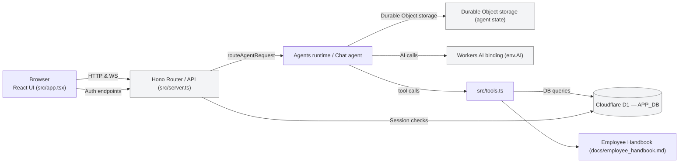
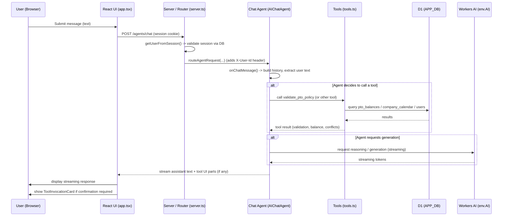
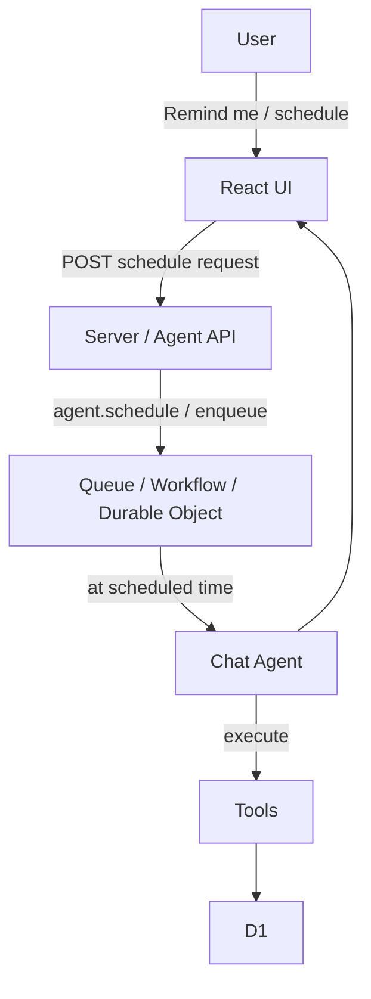

## ApprovalFlow AI — Architecture & Flows

This document summarizes the main components and runtime flows of the project and includes Mermaid diagrams that visualize the system architecture, the message/agent flow, and the scheduling flow.

### Key findings (mapped to files)

- Frontend UI: React app built in `src/app.tsx` and `src/client.tsx`. UI uses `agents/react` and `agents/ai-react` hooks to talk to an agent named `chat` and renders streaming responses. Tools requiring confirmation are wired through `ToolInvocationCard` components.
- Server & routing: `src/server.ts` exposes API routes (auth: `/api/auth/*`) and routes agent traffic via `routeAgentRequest`. It performs session validation (D1 lookup) and injects `X-User-Id` into agent requests.
- Chat agent: Implemented as an `AIChatAgent` subclass in `src/server.ts` (class `Chat`) and delegates reasoning+actions to the ReAct implementation (`runReActAgent` in `src/react-agent.ts`). The agent persists per-agent state using its Durable Object storage (`this.ctx.storage`).
- Tools & data: `src/tools.ts` defines tools (e.g., `validate_pto_policy`, `get_pto_balance`, `submit_pto_request`, `log_audit_event`). Tools call the relational DB via `env.APP_DB` (Cloudflare D1) and may call the AI binding (`env.AI`) for handbook lookups.
- Storage & bindings: The repo uses D1 (APP_DB) for relational data (users, sessions, pto_balances, pto_requests, audit_log), Durable Object storage for agent persisted state, and the Workers AI binding (`env.AI`) for model calls. There are also examples of Queues/Workflows in docs and code comments for scheduling.

### Design contract (short)

- Inputs: HTTP requests from browser (session cookie for auth), agent messages (user text).
- Outputs: Streaming assistant text, tool call results, DB updates (PTO requests, sessions), audit log entries.
- Error modes: missing auth/session → 401; tool errors → agent fallback message; AI provider not configured → UI banner and `/check-ai-provider` endpoint returns failure.

---

## System Architecture (high-level)

Notes:

- `routeAgentRequest` is used to tie incoming HTTP/WebSocket agent traffic to the agent implementation (see `src/server.ts`).
- The agent persists per-user metadata in Durable Object storage (e.g., userId) and uses D1 for application data.

---

## Message / Agent Sequence

Notes:

- Tools that require confirmation are rendered in the UI via `ToolInvocationCard`. The UI sends tool results back to the agent using `addToolResult` / `sendMessage` so the agent can continue.

---

## Scheduling / Delayed Task Flow

Notes:

- The tools and agent code include scheduling and `executeTask` hooks (see `Chat.executeTask` and scheduling notes in README). In production this can map to Cloudflare Queues, Workflows, or Durable Objects that re-invoke the agent at the scheduled time.

---

## How to view/validate these diagrams locally

- The diagrams are Mermaid code blocks. You can view them in VS Code with a Mermaid preview extension or render them using an online Mermaid renderer.
- I validated the Mermaid syntax included here as part of this change.

## Where things live in the repo

- UI: `src/app.tsx`, `src/client.tsx`, `src/components/*`
- Server / Agent: `src/server.ts`, `src/react-agent.ts` (ReAct flow)
- Tools: `src/tools.ts` (tool implementations and DB interactions)
- Docs: `docs/` (this file and other design notes)

---

If you want, I can also generate PNG/SVG exports of these diagrams or add separate individual Mermaid files for each diagram to be rendered by a documentation pipeline.
