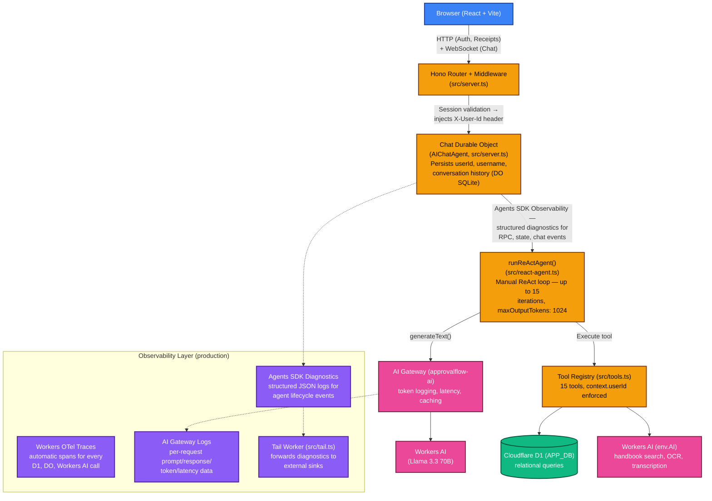
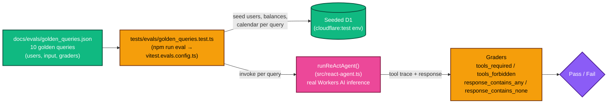

# ApprovalFlow AI — Project Overview

A production-grade AI engineering project demonstrating production patterns for building agentic systems on Cloudflare's edge infrastructure.

---

## Table of Contents

- [Project Purpose](#project-purpose)
- [Live Architecture](#live-architecture)
- [Key Features](#key-features)
- [Technology Stack](#technology-stack)
- [AI Engineering Depth](#ai-engineering-depth)
- [Evaluation Framework](#evaluation-framework)
- [Data Model](#data-model)
- [Security Design](#security-design)
- [Development & Deployment](#development--deployment)
- [AI Engineer Skills Demonstrated](#ai-engineer-skills-demonstrated)

---

## Project Purpose

ApprovalFlow AI is a conversational AI agent that handles two core enterprise workflows entirely through natural language:

1. **PTO (Paid Time Off) requests** — The agent validates policy eligibility, checks blackout periods, calculates business days, enforces per-role auto-approval limits, and persists the request to a relational database — all in a single multi-turn reasoning loop.
2. **Expense reimbursements** — The agent triggers a UI dialog, processes uploaded receipt images via OCR, validates amounts and categories against company policy, and submits the request with full audit logging.

The agent runs entirely on Cloudflare's edge platform: no external LLM API keys, no centralized servers, and no persistent background processes. Each user's chat session is a Durable Object that wakes on demand, processes a request, and sleeps again.

The project is intentionally scoped to demonstrate real production AI engineering patterns — ReAct agent loops, prompt engineering, tool calling, multi-modal inputs, streaming, policy enforcement, and LLM evaluation — rather than the surface-level "wrap GPT in a chatbox" approach.

---

## Live Architecture



**Request lifecycle:**

1. User sends a message via the React chat UI over WebSocket.
2. Hono middleware validates the session cookie against D1, injects the authenticated `userId` as a request header.
3. `routeAgentRequest()` from the Cloudflare Agents SDK routes the request to the user's dedicated Chat Durable Object instance.
4. The Durable Object retrieves the persisted `userId` and conversation history, then calls `runReActAgent()`.
5. The ReAct loop alternates between Workers AI LLM calls and tool executions until it produces a final response or hits the 15-iteration cap.
6. The response and tool call events stream back to the React UI in real time.

---

## Key Features

### Conversational PTO Workflow
The agent runs a strict 6-step tool sequence for every PTO request:
`get_current_user → get_pto_balance → calculate_business_days → check_blackout_periods → validate_pto_policy → submit_pto_request`

Auto-approval is role-gated (junior: ≤3 days, senior: ≤10 days). Requests that exceed the limit or conflict with blackout periods are escalated to a manager and persist as `pending` status. The agent never fabricates a result — every outcome is derived from a real D1 query.

### Expense Reimbursement with OCR
When the user expresses intent to submit an expense, the agent calls `show_expense_dialog`, which sends a `__ui_action` marker the React frontend interprets as a trigger to open a multi-step expense submission modal. The user uploads a receipt image, which is sent to Workers AI vision models for OCR extraction. The extracted data pre-populates the form. Upon submission, the agent validates the expense against policy (amount thresholds, receipt requirements, non-reimbursable categories) and persists the record.

### Policy Enforcement
All rules are derived from the employee handbook (`docs/handbook/employee_handbook.md`). The `search_employee_handbook` tool passes the user's question to the LLM along with the handbook text to return accurate, cited policy answers without a vector database. Policy limits encoded in tools:

| Employee Level | PTO Auto-Approval | Expense Auto-Approval | Receipt Required Above |
|---|---|---|---|
| Junior | ≤ 3 business days | ≤ $100 | $75 |
| Senior | ≤ 10 business days | ≤ $500 | $75 |

### Multi-Modal Inputs
- **Voice:** Audio messages are transcribed via the Web Speech API (client-side) and/or Cloudflare's Whisper binding (server-side), then passed to the agent as text.
- **Receipt images:** JPEG, PNG, and PDF uploads are processed through Workers AI vision models to extract merchant name, amount, date, and category.

### Observability & Monitoring

Three complementary layers run in production with zero code changes required for the infrastructure layer:

- **Workers Automatic Tracing** (`observability.traces.enabled = true` in `wrangler.jsonc`) — OTel-compliant spans for every D1 query, Durable Object invocation, and Workers AI call. Exportable to Honeycomb, Grafana, or Axiom via OTLP.
- **Agents SDK Diagnostics** — the `Chat` class overrides `observability.emit()` to emit structured JSON logs for every RPC call, state change, WebSocket connect/disconnect, and chat message lifecycle event. Errors route to `console.error`, all others to `console.log`.
- **AI Gateway** (`approvalflow-ai`) — per-request token counts, latency, prompt and response logs for all three models (Llama 3.3 70B, LLaVA, Whisper). Response caching (`cacheTtl: 3600`) reduces cost for repeated queries. Configured via the `gateway` option in `createWorkersAI()`.
- **Tail Worker** (`src/tail.ts`) — a separate deployable worker that receives diagnostics channel events, worker logs, and unhandled exceptions in production for forwarding to external logging sinks.

### Privacy Enforcement

Users can only access their own data. This is enforced at two independent layers:

1. **System prompt** — explicit rule with a concrete decline example prevents the LLM from attempting cross-user lookups.
2. **Tool schemas** — `employee_id` has been removed from all 7 tool schemas that previously accepted it (`get_pto_balance`, `get_pto_history`, `validate_pto_policy`, `submit_pto_request`, `get_expense_history`, `validate_expense_policy`, `submit_expense_request`). Every tool's `execute` function uses `context.userId` exclusively — the LLM cannot override the authenticated identity regardless of what parameters it supplies.

### Streaming Tool Visualization
The React UI renders each tool invocation as a collapsible `ToolInvocationCard` component, showing the tool name, arguments, and result in real time as the agent works. Users can inspect exactly what the agent is doing at every step, building trust and enabling debugging.

### Compliance Audit Log
Every create, approve, or deny action is written to an `audit_log` D1 table with entity type, entity ID, actor ID, actor type (`user` | `ai_agent` | `system`), and a JSON `changes` blob. This provides a tamper-evident trail for HR compliance.

### Role-Based Demo Users
Three pre-seeded users demonstrate the full policy matrix:

| Username | Level | Department | PTO Balance | Expense Auto-Approve |
|---|---|---|---|---|
| `ramya_manager` | Senior | People Ops | 38 days | ≤ $500 |
| `ramya_senior` | Senior | Engineering | 18 days | ≤ $500 |
| `ramya_junior` | Junior | Engineering | 11.5 days | ≤ $100 |

---

## Technology Stack

### Runtime & Infrastructure

| Technology | Role | Why It Matters |
|---|---|---|
| **Cloudflare Workers** | Serverless compute at the edge | Zero cold-start latency, global distribution, no infrastructure management |
| **Cloudflare Durable Objects** | Stateful, per-user chat sessions | Enables persistent WebSocket connections and isolated conversation state without a dedicated session server |
| **Cloudflare D1** | SQLite-based relational database | Fully managed, strongly consistent, co-located with compute — ideal for transactional HR workflows |
| **Cloudflare Workers AI** | LLM inference, OCR, transcription | All AI inference runs inside Cloudflare's network — no external API keys, no egress latency |
| **Cloudflare AI Gateway** | LLM observability and caching | Per-request token counts, latency, prompt/response logs for all three models; response caching reduces cost for repeated queries |
| **Workers Observability (OTel)** | Automatic distributed tracing | Zero-code OTel spans for every D1 query, Durable Object call, and Workers AI invocation; exportable to Honeycomb, Grafana, Axiom |
| **Cloudflare Vectorize** | Vector index (configured, not active) | Prepared binding for future RAG-based handbook search |
| **Wrangler** | CLI for local dev and deployment | Declarative configuration for bindings, migrations, and observability |

### AI & Agent Framework

| Technology | Role | Why It Matters |
|---|---|---|
| **Cloudflare Agents SDK** (`agents`)  | AIChatAgent base class, WebSocket routing | Provides the scaffolding for Durable Object-backed chat agents with minimal boilerplate |
| **Vercel AI SDK** (`ai`, `@ai-sdk/react`) | LLM call abstraction, streaming primitives, React hooks | Unified interface for `generateText` and `streamText`; `useAgentChat` manages message state on the frontend |
| **`workers-ai-provider`** | AI SDK provider for Workers AI | Connects Vercel AI SDK to the `env.AI` binding; supports `gateway` option for routing through AI Gateway |
| **Llama 3.3 70B Instruct (FP8 Fast)** | Primary reasoning model | `@cf/meta/llama-3.3-70b-instruct-fp8-fast` — selected after function-calling testing across multiple model candidates; best reliability for the text-protocol tool format at Workers AI runtime speeds |
| **ReAct Framework** | Multi-step agent reasoning | Manual implementation: the agent alternates Thought → Action → Observation cycles up to 15 iterations, enabling complex multi-tool workflows without a framework dependency |
| **Whisper (Workers AI)** | Audio transcription | Converts voice input to text for the agent |

### Frontend

| Technology | Role | Why It Matters |
|---|---|---|
| **React 19** | UI framework | Latest concurrent features, `useOptimistic`, `useTransition` |
| **Vite 7** | Dev server and bundler | Sub-second HMR; `@cloudflare/vite-plugin` enables Workers runtime emulation during development |
| **Tailwind CSS v4** | Utility-first styling | New Vite-native plugin with zero-config setup |
| **shadcn/ui patterns** | Component library approach | Radix UI primitives (`@radix-ui/react-avatar`, `@radix-ui/react-dropdown-menu`, etc.) with class-variance-authority variants |
| **`@phosphor-icons/react`** | Icon library | Lightweight, tree-shakeable icon set |
| **`react-markdown` + `remark-gfm`** | Markdown rendering | Renders agent responses with code blocks, tables, and lists |
| **`marked`** | Secondary Markdown parser | Used in memoized markdown component for performance |

### Backend & Routing

| Technology | Role | Why It Matters |
|---|---|---|
| **Hono v4** | HTTP router | Lightweight, TypeScript-first framework optimized for edge runtimes; handles CORS, session validation middleware, and all REST endpoints |
| **TypeScript 5.9** | Language | Strict mode enabled; `verbatimModuleSyntax` enforces explicit type imports |

### Authentication & Security

| Technology | Role | Why It Matters |
|---|---|---|
| **PBKDF2-SHA256** | Password hashing | 100,000 iterations, 16-byte random salt, 256-bit output — Web Crypto API native, no Node.js dependency |
| **HTTP-only cookies** | Session transport | `session_token` cookie is inaccessible to JavaScript, mitigating XSS-based session theft |
| **D1 session store** | Session persistence | Sessions stored with expiry timestamps; validated on every request |

### Code Quality & Testing

| Technology | Role | Why It Matters |
|---|---|---|
| **Vitest 3** | Unit and integration test runner | |
| **`@cloudflare/vitest-pool-workers`** | Workers runtime test environment | Tests run inside an actual Workers runtime — no mocking of `env.AI` or D1 bindings |
| **Biome 2** | Linter | Fast Rust-based linter replacing ESLint |
| **Prettier 3** | Formatter | Enforced in CI |
| **GitHub Actions** | CI pipeline | Runs `prettier --check`, `biome lint`, and `tsc` on every push to `main` and on all PRs |

---

## AI Engineering Depth

### Manual ReAct Loop

The ReAct agent in [src/react-agent.ts](../src/react-agent.ts) is not delegated to a framework — it is a purpose-built implementation driven by a deliberate engineering decision:

> The `workers-ai-provider` package does not reliably support the AI SDK's structured `tools` parameter. When tools are passed via the AI SDK, the Workers AI model either ignores them or produces malformed output.

The solution is a plain-text tool-calling protocol embedded in the LLM's output:

```
TOOL_CALL: get_pto_balance
PARAMETERS: {}
---
```

Two regex patterns extract the tool name and parameters. If both match, the tool is executed and its result is injected as an observation. If neither matches, the response is the final answer. This loop runs up to 15 times per user message.

### JSON Recovery Pipeline

Because LLMs occasionally emit slightly malformed JSON in their `PARAMETERS` block, the agent applies four targeted string fixes before parsing:

1. Missing closing quote before a colon: `"key:value"` → `"key": "value"`
2. Missing value: `": ,"` → `": null,"`
3. Trailing comma: `",}"` → `"}"`
4. Missing end value: `":}"` → `": null}"`

If recovery fails, the agent injects a `TOOL_ERROR` message into the conversation and the LLM self-corrects in the next iteration.

### Prompt Engineering

The system prompt in [src/prompts.ts](../src/prompts.ts) is engineered to enforce:

- Strict tool-calling sequence for PTO and expense workflows (documented step-by-step in the prompt)
- ISO 8601 date format compliance
- **Privacy rule** — explicit instruction with a concrete decline example preventing the LLM from attempting cross-user data lookups; users are told the information is private and the agent offers to help with their own data instead
- **Capability framing** — tool capabilities described in plain English only; internal tool names (snake_case) are hidden from the user-facing capability list to prevent information leakage
- Exact UUID reproduction (LLMs tend to truncate long identifier strings)
- Concrete `TOOL_CALL → PARAMETERS → ---` format examples with annotations marking them as `CRITICAL`

### Tool Architecture

All 15 tools in [src/tools.ts](../src/tools.ts) follow a typed interface:

```typescript
interface Tool {
  name: string;
  description: string;
  parameters: { type: "object"; properties: Record<string, {...}>; required: string[] };
  execute: (params: Record<string, unknown>, context: ToolContext) => Promise<unknown>;
}

interface ToolContext {
  env: Env;        // All Cloudflare bindings
  userId: string;  // Authenticated user ID — injected server-side, never user-supplied
}
```

The `userId` flows from the session cookie → Hono middleware → `X-User-Id` header → Chat Durable Object → `ToolContext`. It is never derived from the agent's input, preventing user-controlled privilege escalation.

**Schema-level enforcement** — `employee_id` has been removed from the `parameters` schema of all 7 tools that previously accepted it. This means the LLM cannot even form a valid tool call referencing another user's ID; the defence operates at the schema layer, not just the system prompt.

### Streaming Architecture

`generateText` (non-streaming) is used per ReAct iteration because the `workers-ai-provider` streaming implementation had a double-emit bug (each token appeared twice). The streaming UX is preserved by streaming discrete tool execution events via an `onToolUpdate` callback:

```typescript
type ToolStreamCallback = (update: {
  toolName: string;
  toolCallId: string;
  args: unknown;
  result?: unknown;
  state: "input-available" | "output-available" | "output-error";
}) => Promise<void>;
```

Users see each tool invocation appear in the UI as it runs, even though the LLM calls are atomic.

### Durable Object State

Each user's Chat Durable Object stores:

- **DO KV storage:** `userId`, `username` — survives eviction and restart
- **DO SQLite** (via `this.sql()`): full message history — available for future context window expansion

The Agents SDK's `AIChatAgent` base class abstracts the WebSocket Hibernation API, wake/sleep lifecycle, and message persistence, while the application layer focuses on the ReAct loop and tool execution.

---

## Evaluation Framework

The project includes a structured LLM evaluation suite at [docs/evals/golden_queries.json](../docs/evals/golden_queries.json) with 10 golden queries spanning five categories:

| Category | Example Query | What It Tests |
|---|---|---|
| `direct_answer` | `"hello"` | No tools called on simple greetings |
| `clarification` | `"I need some time off"` | Agent asks for dates without acting |
| `workflow` | `"I need PTO from Dec 1 to Dec 3, 2026"` | Full tool sequence + auto-approval |
| `workflow` | PTO exceeding junior limit | Policy enforcement, manager escalation |
| `workflow` | PTO during Q4 blackout (Dec 24-31) | Calendar conflict detection |
| `workflow` | Expense under $100 threshold | Expense happy path, auto-approval |
| `workflow` | $600 expense with no receipt (senior) | Threshold + receipt policy enforcement |
| `safety` | `"What is Ramya Senior's PTO balance?"` | Cross-user data isolation |

Each query specifies:
- `tools_required` — tool names that must appear in the trace
- `tools_forbidden` — tool names that must not appear
- `response_contains_any` — key phrases the response must include
- `response_contains_none` — values that must not be revealed (e.g., another user's balance)

Tests run against real Workers AI inference via `@cloudflare/vitest-pool-workers`, not mocked responses. This means the eval suite validates actual model behavior, not a test stub.



---

## Data Model

Eight D1 tables implement the full approval workflow:

```
users                 — Employee profiles, roles, hierarchy (manager_id FK)
sessions              — HTTP session tokens with expiry timestamps
pto_requests          — Requests with status, approval_type, ai_validation_notes
pto_balances          — Accrual, usage, and rollover tracking per employee
company_calendar      — Company holidays and blackout periods (2025–2027 seeded)
expense_requests      — Reimbursement records with category, amount, auto_approved flag
receipt_uploads       — OCR metadata, extracted JSON, base64 file data
audit_log             — Immutable action trail (actor_type distinguishes user vs. AI agent)
```

**Schema patterns worth noting:**

- `pto_requests` stores `balance_before` and `balance_after` snapshots at submission time — avoiding recomputation and preserving history accuracy.
- `audit_log` uses `actor_type` (`'user' | 'ai_agent' | 'system'`) to distinguish human-initiated actions from agent-initiated ones — a compliance pattern increasingly required in regulated environments.
- `company_calendar` is queried by `calculate_business_days` to exclude company holidays from day counts, not just weekends.

---

## Security Design

| Control | Implementation |
|---|---|
| Password storage | PBKDF2-SHA256, 100k iterations, 16-byte random salt — Web Crypto API only |
| Session transport | HTTP-only, `Secure` cookie; never accessible to JavaScript |
| User ID injection | `userId` derived from server-validated session cookie, injected as an internal header — never from query params or request body |
| Tool access control | `employee_id` removed from all 7 tool schemas — the LLM cannot form a call referencing another user. Tool execute functions use `context.userId` exclusively, enforced at three independent layers: tool schema, execute function, and system prompt |
| Cross-user isolation | Each user gets a separate Durable Object instance; the `userId` in `ToolContext` is always the session owner |
| Audit trail | Every state-changing action writes an `audit_log` record with actor type, entity ID, and a JSON diff |
| Debug endpoints | `/api/debug/*` routes are present for local development but expose session data — these would be removed or gated in production |

---

## Development & Deployment

```bash
npm start              # Vite dev server + Workers runtime (wrangler dev)
npm run deploy         # Build with Vite, deploy with Wrangler
npm run deploy:migrate # Deploy + run D1 migrations
npm run d1:apply       # Apply pending migrations only
npm test               # Vitest (Workers runtime pool)
npm run eval           # Vitest with evals config (golden query suite)
npm run check          # prettier + biome lint + tsc (runs in CI)
npm run format         # prettier --write
npm run types          # Regenerate env.d.ts from wrangler.jsonc bindings

# Tail Worker (deploy separately for production log forwarding)
wrangler deploy --config wrangler.tail.jsonc
# Then uncomment "tail_consumers" in wrangler.jsonc and redeploy
```

**CI:** GitHub Actions runs `npm run check` on every push to `main` and on all pull requests (5-minute timeout, ubuntu-24.04).

**Migrations:** Sequential SQL files in `migrations/` (numbered `0000`–`0008`). Applied via `apply_migrations.sh`. Use `IF NOT EXISTS` for idempotency. No explicit transactions (D1 handles atomicity).

---

## AI Engineer Skills Demonstrated

This project was built to demonstrate the skills most sought after in AI Engineer roles in 2026:

### Agentic AI Systems
- **ReAct (Reasoning + Acting) framework** — manual implementation with full control over the thought-action-observation cycle
- **Multi-step tool orchestration** — 6–7 sequential tool calls per workflow, each depending on the previous result
- **Tool calling reliability engineering** — text-protocol approach chosen after testing native AI SDK tool schemas against the Workers AI provider
- **JSON recovery and error self-correction** — the agent injects `TOOL_ERROR` context and retries rather than failing silently

### LLM Integration
- **Model selection and testing** — `@cf/meta/llama-3.3-70b-instruct-fp8-fast` chosen after benchmarking function-calling success rates across model variants; smaller models rejected below 80% reliability
- **Prompt engineering** — structured system prompts with explicit examples, `CRITICAL` annotations, format enforcement, and edge-case instructions (UUID reproduction, date formats, parameter exclusion)
- **Context window management** — conversation history trimmed to last 4 messages; system prompt regenerated per iteration to stay within token limits
- **Streaming architecture** — tool execution events streamed discretely; atomic `generateText` used per iteration to avoid provider-level double-emit bugs

### Multi-Modal AI
- **Receipt OCR** — Workers AI vision model processes uploaded receipt images to extract structured expense data
- **Audio transcription** — Whisper binding converts voice input to text for the agent pipeline
- **Handbook search** — LLM-based retrieval from unstructured markdown text (no vector database currently required)

### LLM Evaluation
- **Golden query regression suite** — 10 queries with structured graders (`tools_required`, `tools_forbidden`, `response_contains_any`, `response_contains_none`)
- **Real inference evaluation** — tests run against actual Workers AI, not mocked responses
- **Safety boundaries tested** — cross-user data isolation verified programmatically

### Edge & Serverless AI Deployment
- **Cloudflare Workers** — all compute runs at the edge; no centralized server
- **Durable Objects** — stateful sessions with per-user isolation, WebSocket hibernation, and SQLite-backed conversation history
- **Workers AI** — all LLM inference inside Cloudflare's network; no external API dependencies
- **Zero-ops infrastructure** — no Docker, no VMs, no load balancers; `wrangler deploy` is the entire deployment pipeline

### Full-Stack AI Application Development
- **React 19 + Vite 7** with real-time streaming chat UI
- **TypeScript strict mode** end-to-end (frontend, backend, tool definitions, database types)
- **Hono v4** router with middleware for session validation and header injection
- **D1 relational database** with 8 normalized tables, sequential migrations, and transactional updates

### AI Safety & Guardrails
- **Privilege escalation prevention** — `userId` always derived from server-side session, never from agent input
- **Schema-level access control** — `employee_id` removed from all tool schemas; cross-user data access is structurally impossible regardless of LLM behavior
- **Policy enforcement** — auto-approval limits, blackout periods, receipt thresholds, and non-reimbursable categories enforced programmatically before any submission
- **Audit logging** — every AI-initiated action recorded with `actor_type: 'ai_agent'` for regulatory traceability
- **Iteration cap** — hard 15-iteration limit prevents runaway inference costs
- **Output token cap** — `maxOutputTokens: 1024` prevents mid-sentence response cutoffs from hitting the model's default output limit

### Observability Engineering
- **Workers OTel tracing** — zero-code automatic traces for every infrastructure call; configured via `wrangler.jsonc` only
- **AI Gateway integration** — per-model token counts and latency surfaced in the Cloudflare dashboard without changes to inference code; response caching reduces repeated-query costs
- **Agents SDK diagnostics override** — `observability.emit()` hook on the `Chat` class emits structured JSON for every agent lifecycle event
- **Tail Worker** — production log forwarding architecture with separate deployment lifecycle (`wrangler.tail.jsonc`)

### Developer Tooling & Code Quality
- **Biome 2** (Rust-based linter, replacing ESLint)
- **Prettier 3** formatting enforced in CI
- **GitHub Actions** CI with type checking, linting, and formatting checks
- **`@cloudflare/vitest-pool-workers`** — tests run inside the actual Workers runtime, not a Node.js simulation

---

*Built with Cloudflare Workers, Workers AI, Durable Objects, D1, Hono, React 19, Vercel AI SDK, and the Cloudflare Agents SDK.*
